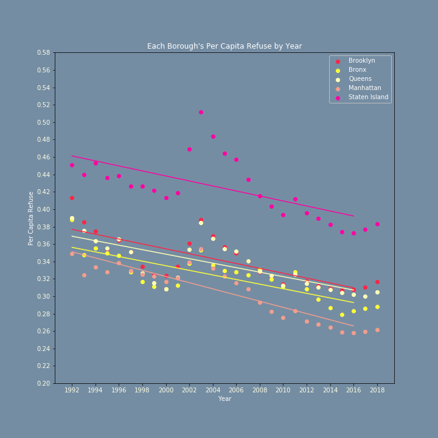
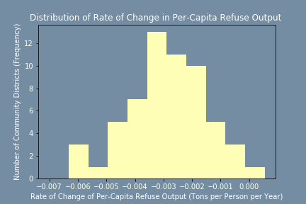
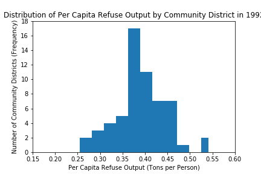
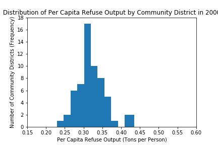
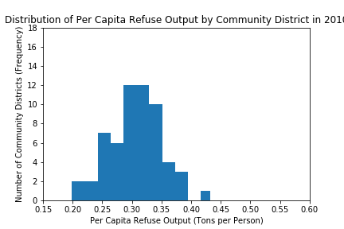
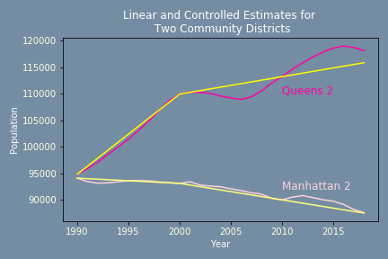
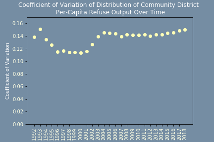

<h1>Analysis of Waste Production in New York City, 1992-2019</h1>

We examined trends in population, total and per capita refuse, and recycling to determine the state of waste production in NYC for the years 1992-2019. Variables considered include tons of trash (refuse)  paper, and metal, glass and plastic recycling collected from NYC residences and institutions serviced by the NYC Department of Sanitation. We did not include any organics refuse information as it was severely incomplete in the NYC archives.

We found that both total and per capita trash production tended to decrease between 1992 and 2018. Recycling of paper decreased slightly and recycling of metal, glass and plastic increased slightly.

Below, we show a total overall decrease in trash production in the five boroughs of NYC in the years 1992-2018. Trash production increased slightly between 2000 and 2004, before exhibiting a consistent downward trend.

  

Recycling of paper and metal, glass, and plastic did not exhibit any significant change as a percentage of total refuse and recycling production, decreasing from 10.9% to 9.5% of total for paper and increasing from 7.1% to 9.7% of total for metal, glass, and plastic.

  
  

Refuse production decreased both in total and on a per-capita basis in every borough of New York City, with Staten Island producing the most refuse per person.  Linear regressions performed on the annual per-capita rate of refuse production in each borough show similar rates of decrease in refuse production between the five boroughs.  For further details, including r-values for regressions, see <a href=https://github.com/JacobSpear/NewYorkWaste/blob/master/Analysis_Notebooks/Trash%20Output%20Time%20Borough.ipynb> our notebook</a>. 

  

Refuse production also decreased in most community districts, being approximately normally distributed with mean at about -3 kilograms per person per year.

This community district-level decrease in refuse production can also be seen as the distribution of refuse production shifts left between 1992 and 2008, as shown in the histograms below (bin size is half a standard deviation).

 

 

Overall, we have found evidence of a consistent decrease in refuse production between and within New York City’s boroughs and neighborhoods between 1992 and 2018, though the rate of this decrease varied significantly throughout the city (coefficient of variation = -0.5). In particular, approximately 17% of community districts decreased their refuse production at least 50% faster than the mean rate of decrease. These findings suggest the need for further studies examining whether the variation in rates of refuse production decrease between community districts is due to random variation or due to sociopolitical, environmental, or other pressures.

<h2>Data Sources</h2>

We sourced <a href=https://data.cityofnewyork.us/City-Government/DSNY-Monthly-Tonnage-Data/ebb7-mvp5> refuse</a>, <a href=https://data.cityofnewyork.us/City-Government/DSNY-Monthly-Tonnage-Data/ebb7-mvp5> recycling</a>, and <a href=https://data.cityofnewyork.us/City-Government/New-York-City-Population-By-Community-Districts/xi7c-iiu2> population</a> data from the NYC Open Data portal and census population data for <a href=https://www.census.gov/data/tables/time-series/demo/popest/intercensal-1990-2000-state-and-county-totals.html> 1990-2000</a>, <a href=https://www.census.gov/data/tables/time-series/demo/popest/intercensal-2000-2010-counties.html> 2000-2010</a>, and <a href=https://www.census.gov/data/tables/time-series/demo/popest/2010s-counties-total.html> 2010-2018</a>.

<h2>Approach</h2>

We used total refuse information for the years 1992 to 2018, as this was the most complete set of information for all five NYC boroughs and was comprised of 19,824 observations. We looked at the total tons of refuse produced in the whole city to determine the overall trend of waste production during this time period.
 

In order to control for changes in population, the bulk of our analysis considers per-capita refuse production in tons per person per year. However, obtaining population estimates with which to compute per-capita refuse production was not straightforward.  The only data available were decennial census measurements of community-district level population, as well as annual intercensal estimates of borough population.
  

To compute per-capita refuse production on the community-district level, we used scaled borough-level intercensal estimates to match our community-district estimate totals in census years. Then, we made estimates of community-district level population in between census years by assuming linear rates of change between census measurements. Finally, we adjusted our linear estimates by controlling to the re-scaled borough-level intercensal data. Below, we include our linear (yellow) and final controlled (pink) estimates over time for two community districts. For a more detailed discussion of our methods, see <a href=https://github.com/JacobSpear/NewYorkWaste/blob/master/Population_Estimate_Analysis/Population%20Estimates.ipynb> our notebook</a>.

When looking at the combined NYC dataset for both refuse and population, we were able to delineate a number of observations derived by looking at each of the five NYC Boroughs. Applying linear regression lines allowed us to examine our data at a more meaningful level. This allows us to see inferences over time when looking at individual boroughs.

During the observed years of 1992-2018, we can demonstrate that the per capita refuse declined in all 5 boroughs.  Analysis of outliers does show some irregularities compared to the regression. Even though overall refuse has decreased we can observe that there was an increase in per capita refuse in relation to all 5 boroughs, especially during the years surrounding 2002 through 2004. These spikes in deviation do not negate our findings that there was an overall decrease throughout the time period examined.

As it was not feasible to display similar graphs and regression lines for all 59 community districts, we represent the slopes of the regression lines for per-capita refuse production in each community district over time as a histogram (see above).  We also generate histograms showing the distribution of trash output of four years (see above).  Note that in the year 2000, the spread of this data appears to be smaller.  This prompts the question: “How did the variability of per-capita trash production change over time?”  In order to answer this question, we use the coefficient of variation, the ratio of the mean and standard deviation.  Put another way, the coefficient of variation expresses the standard deviation in terms of the mean.  For example, a coefficient of variation of 0.12 means that one standard deviation is equivalent to 0.12 times the mean.

To see why the coefficient of variation is an appropriate measure of spread in this context, consider the following analogy: in a room of billionaires, the standard deviation of wealth would be in the billions.  In a room full of individuals with net worth in the ten thousands, the standard deviation of wealth would likely be in the ten thousands.  It would not be reasonable to suggest that the net worth of billionaire’s is 100,000 times greater than that of middle class individuals.  Rather, in this context and in the context of our analysis, a more meaningful measurement is the ratio of the standard deviation to the mean.

In order to determine whether community district refuse production became more or less varied over time, we computed the coefficient of variation of per-capita refuse production over the 59 community districts in each year 1992 to 2018, as displayed below. We see that between 1993 and 2000, variability between community districts was lower relative to mean trash output compared to other years.

We used recycling of paper and metal, glass, plastic information for the years 2005-2019, as this was the most complete set of information for all five NYC boroughs and was comprised of 10,620 observations for paper recycling and 10,620 observations for metal, glass, and plastic recycling.  The proportion of waste comprised of refuse, paper, and metal, glass, plastic respectively changed only slightly over the decade for which data were available.

<h2>Going Further</h2>

Our data suggest the need for further exploration of the reasons for the negative trend in refuse production in New York City. Can a similar trend be found nationally and, if not, where can such a trend be found? Can variation in refuse production between community districts and boroughs be accounted for by randomness, or is there an underlying cause?

Does income play a role in the amount of trash a person generates?

How people live their lives and the amount of waste that they produce is connected to how much money they have at their disposal. Gathering income data would be beneficial in determining what impact someone’s income may have on the amount of waste that they produce. Finding income data on a per borough basis or even by community district would be ideal for digging deeper in this aspect. 

Have laws changed the way NYC disposes of waste?

The fact that our observations have shown a population increase and an overall per capita refuse decrease raises some serious questions. Is it possible New Yorker’s have been forced to reduce their waste footprint by the enactment of new laws? Further research would need to be done to determine if any new laws that may affect waste were enacted.

Does the attitude of people affect the amount of waste that is produced?

The tendency that people in general have become more aware of the environment and potential ways to improve it could be a cause in decrease of refuse. In order to look at social sentiment in this emerging topic, we would need to be creative when looking for relevant data. One possible method might be to look for data involving social issues in regards to political campaigns and what people voiced as an important issue in a given election cycle. 

Does weather affect the amount of refuse NYC produces?

Weather is presumed to affect everything. It could be beneficial to examine temperatures and extreme weather events to see if there was a correlation in the amount of waste produced. Climate data would be easily accessible and very useful in determining a number of factors. 

